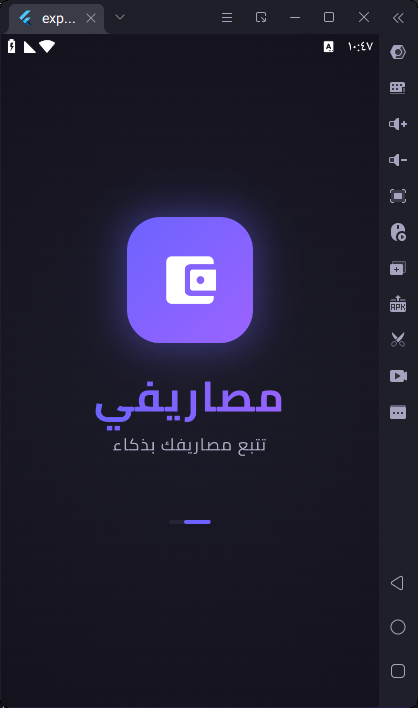
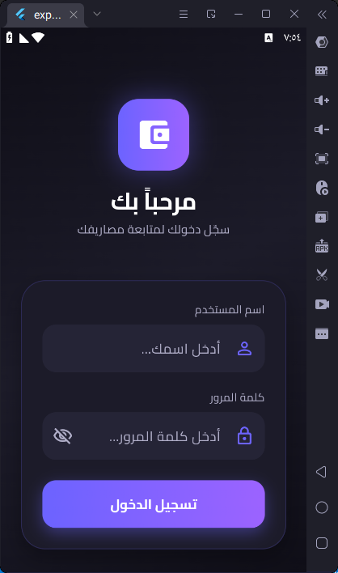
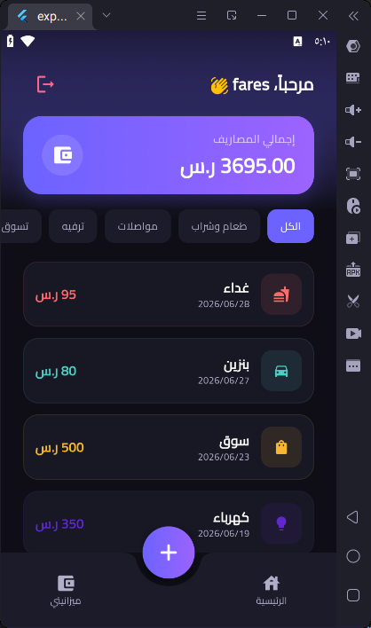
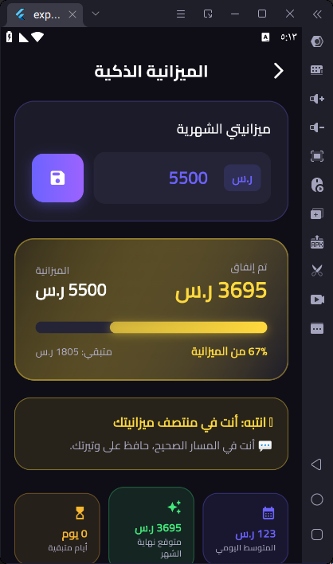
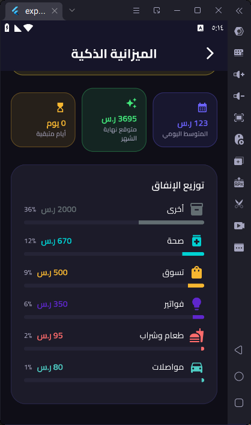

💸 Masarify — Expense Manager App

  
  <strong>A fully offline personal finance and expense tracker application built with Flutter.</strong>  

  
  
    
    
    
  
---

📱 Screenshots

Splash Screen	Login / Register	Home Screen

		

Add Expense	Smart Budget Overview	Budget Analytics

		

---

✨ Features

🔒 Local Authentication — Fully offline registration and secure sign-in logic.

💾 Persistent Storage — Relies on a local SQLite database to keep all financial data sandboxed safely on your device.

💡 Smart Budgeting — Dynamic monthly expenditure targeting with intuitive alert thresholds (Safe 🟢 / Warning 🟡 / Danger 🔴).

🗂 Categorization & Filtering — 8 pre-defined categories with customized iconography and styling. Instantly search, sort, and filter logs.

🌙 Modern Material 3 UI — A beautiful, dark-themed experience enhanced with fluid, declarative animations.

---

🏗 Project Structure (Clean Architecture)

├── main.dart  
├── models/                    # Data Layer Models  
│   ├── user_model.dart        # User entity + Serialization (toMap/fromMap)  
│   └── expense_model.dart     # Expense entity + Setup configurations  
├── services/                  # Global & System Services  
│   ├── database_service.dart  # SQLite operations (Singleton Pattern)  
│   ├── app_theme.dart         # Material 3 Dark Theme mapping  
│   └── app_routes.dart        # Core routing and Bindings mapping  
├── controllers/               # Business Logic (GetX Controllers)  
│   ├── auth_controller.dart   # Session & user registration logic  
│   ├── expense_controller.dart# CRUD operations for expenses  
│   └── budget_controller.dart # Budget calculations & thresholds  
├── bindings/                  # Dependency Injection via GetX  
│   ├── auth_binding.dart  
│   ├── home_binding.dart  
│   └── budget_binding.dart  
└── views/                     # Presentation Layer (UI Components)  
    ├── add_expense_screen.dart  
    ├── auth_screen.dart  
    ├── budget_screen.dart  
    ├── home_screen.dart  
    └── splash_screen.dart

Data Flow Lifecycle

graph LR  
    View[UI Screen] -->|Event| Controller[GetX Controller]  
    Controller -->|Query| DB[Database Service]  
    DB -->|Fetch/Commit| SQLite[(SQLite)]  
    SQLite -->|Update State| Rx[Rx Variables]  
    Rx -->|Reactive Rebuild| Obx[Obx Widget]

🗄️ Database Schema

users Table

Column	Type	Description

id	INTEGER PK	Auto-increment ID
name	TEXT	Unique username
password	TEXT	Hashed password

expenses Table

Column	Type	Description

id	INTEGER PK	Auto-increment ID
user_id	INTEGER FK	References users(id) (ON DELETE CASCADE)
title	TEXT	Expense description
amount	REAL	Monetary value
date	TEXT	ISO 8601 Timestamp
category	TEXT	Category tag

🧠 Core Concepts Applied

Clean Architecture & Repository Pattern — Decoupling logic from raw database executions.

Singleton Pattern — Thread-safe DatabaseService instance.

Observer Pattern & DI — Utilizing GetX .obs reactive streams and automated lifecycle bindings.

Concurrent Optimization — Running multiple metrics parallel using Future.wait.

🚀 Getting Started

git clone [https://github.com/RinadSalem/expense_manager.git](https://github.com/RinadSalem/expense_manager.git)  
cd expense_manager  
flutter pub get  
flutter run
