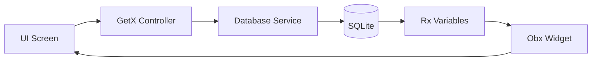

# 💸 Masarify — Expense Manager

<p align="center">
  <strong>A fully offline personal finance and expense tracker built with Flutter.</strong>
</p>

<p align="center">
  
  
  
  
</p>

---

# 📱 Screenshots

| Splash Screen | Login | Home |
|:--------------:|:------:|:----:|
|  |  |  |

| Add Expense | Budget Overview | Analytics |
|:-----------:|:---------------:|:---------:|
|  |  |  |

---

# ✨ Features

- 🔒 **Offline Authentication**
  - Local registration and login.
  - No internet connection required.

- 💾 **SQLite Database**
  - Secure local storage.
  - Persistent financial records.

- 💰 **Smart Budget Management**
  - Monthly budget tracking.
  - Spending alerts:
    - 🟢 Safe
    - 🟡 Warning
    - 🔴 Danger

- 📂 **Expense Categories**
  - 8 predefined categories.
  - Search, sort, and filtering support.

- 🌙 **Modern UI**
  - Material 3 Design
  - Dark Theme
  - Smooth Flutter animations

---

# 🏗️ Project Architecture

```
lib
│
├── main.dart
│
├── models
│   ├── user_model.dart
│   └── expense_model.dart
│
├── services
│   ├── database_service.dart
│   ├── app_theme.dart
│   └── app_routes.dart
│
├── controllers
│   ├── auth_controller.dart
│   ├── expense_controller.dart
│   └── budget_controller.dart
│
├── bindings
│   ├── auth_binding.dart
│   ├── home_binding.dart
│   └── budget_binding.dart
│
└── views
    ├── splash_screen.dart
    ├── auth_screen.dart
    ├── home_screen.dart
    ├── add_expense_screen.dart
    └── budget_screen.dart
```

---

# 🔄 Data Flow



---

# 🗄️ Database Schema

## Users Table

| Column | Type | Description |
|---------|------|-------------|
| id | INTEGER | Primary Key |
| name | TEXT | Unique Username |
| password | TEXT | Hashed Password |

---

## Expenses Table

| Column | Type | Description |
|---------|------|-------------|
| id | INTEGER | Primary Key |
| user_id | INTEGER | Foreign Key |
| title | TEXT | Expense Title |
| amount | REAL | Expense Amount |
| date | TEXT | ISO 8601 Date |
| category | TEXT | Expense Category |

---

# 🧠 Design Patterns & Concepts

- ✅ Clean Architecture
- ✅ Repository Pattern
- ✅ Singleton Pattern
- ✅ Dependency Injection (GetX)
- ✅ Observer Pattern (.obs)
- ✅ Reactive Programming
- ✅ Future.wait() Optimization

---

# 🚀 Getting Started

### Clone the repository

```bash
git clone https://github.com/RinadSalem/expense_manager.git
```

### Navigate to the project

```bash
cd expense_manager
```

### Install dependencies

```bash
flutter pub get
```

### Run the application

```bash
flutter run
```

---

# 🛠️ Built With

- Flutter
- Dart
- GetX
- SQLite
- Material 3

---

# 📌 Highlights

- 📱 Fully Offline
- 🔐 Local Authentication
- 💾 SQLite Storage
- 📊 Budget Analytics
- ⚡ Reactive UI using GetX
- 🌙 Material 3 Design

---

## 👨‍💻 Developer

**Rinad Salem**

GitHub: **https://github.com/RinadSalem**

---

<p align="center">
⭐ If you like this project, don't forget to star the repository.
</p>
